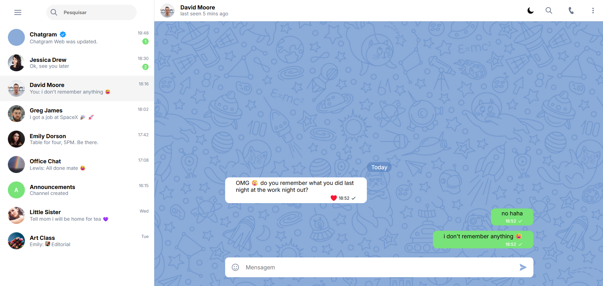
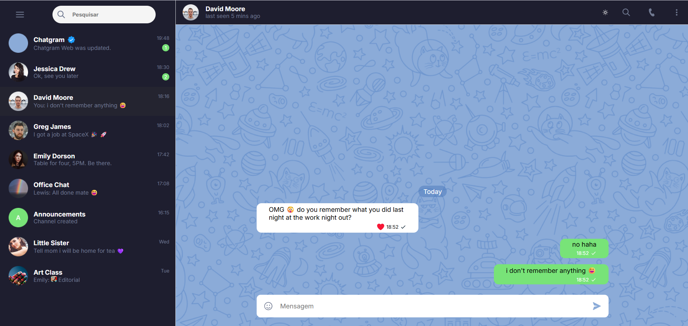

# 💬 Chat Fake

Um projeto de simulação de conversas desenvolvido com foco em **aprimoramento das habilidades em JavaScript**, permitindo criar interações visuais realistas com mensagens, contatos e emojis.
Este projeto é ideal para testar lógicas de UI, DOM dinâmico e simulações de aplicativos de mensagens.

---

## 🖼️ Captura de Tela

- Tema Claro



- Tema Escuro



---

## 🛠️ Funcionalidades

- Simulação de conversas entre usuário e um "BOT" (Mensagens automáticas disponíveis dentro de um Array).
- Interface intuitiva para criação.
- Eventos de Clique e Teclado para envio de mensagens.
- Evento de Clique para tranformar o Chat em Modo Dark e Light.
- Criação manual de mensagens.
- Estilização inspirada em apps de mensagens reais.

---

## 🧠 Melhorias Planejadas

| Funcionalidade | Descrição |
|----------------|-----------|
| **🛠 Criando Conversas Dinamicamente** | Permitir ao usuário adicionar mensagens em tempo real, simulando uma conversa fluida entre diferentes perfis/personagens. |
| **📡 Carregando Dados Dinamicamente** | Recuperar e exibir conversas, contatos ou configurações previamente salvos sem recarregar a página. |
| **🔍 Buscando Contatos** | Sistema de busca em tempo real para localizar contatos por nome ou status. |
| **🔎 Buscando Mensagens** | Busca de mensagens específicas dentro da conversa, com destaque e rolagem automática até o conteúdo. |
| **😄 Adicionando Emojis** | Inclusão de um seletor de emojis para tornar as mensagens mais expressivas. |
| **🔔 Notificando Mensagens** | Simulação de notificações com sons, animações e indicadores visuais de nova mensagem. |

---

## 📚 Objetivo do Projeto

Este projeto foi criado com fins **educacionais** e de **aprimoramento técnico**, servindo como laboratório de experimentação com **JavaScript puro**, **event listeners**, **manipulação de DOM**, **responsividade** e simulações interativas.

---

## 📦 Tecnologias Utilizadas

- **HTML5** e **CSS3** para estrutura e estilo.
- **JavaScript** para interatividade, eventos e simulação de chat.

---

## 🧑‍💻 Autor

Desenvolvido por **Daniel Bonfim**  
[🔗 GitHub](https://github.com/dev-danielbonfim)

---

## ⚙️ Como Executar Localmente

1. Clone o repositório:

   ```bash
   git clone https://github.com/dev-danielbonfim/chat-fake.git
